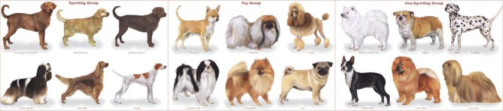
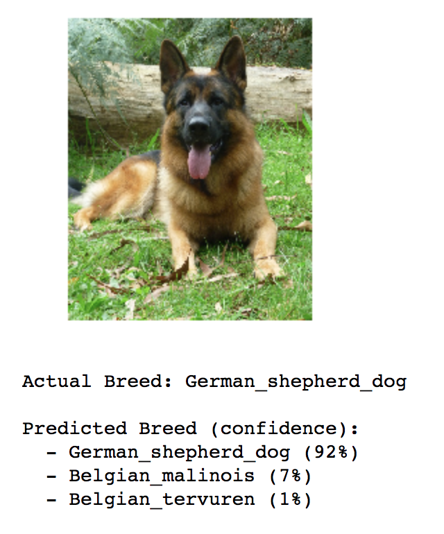
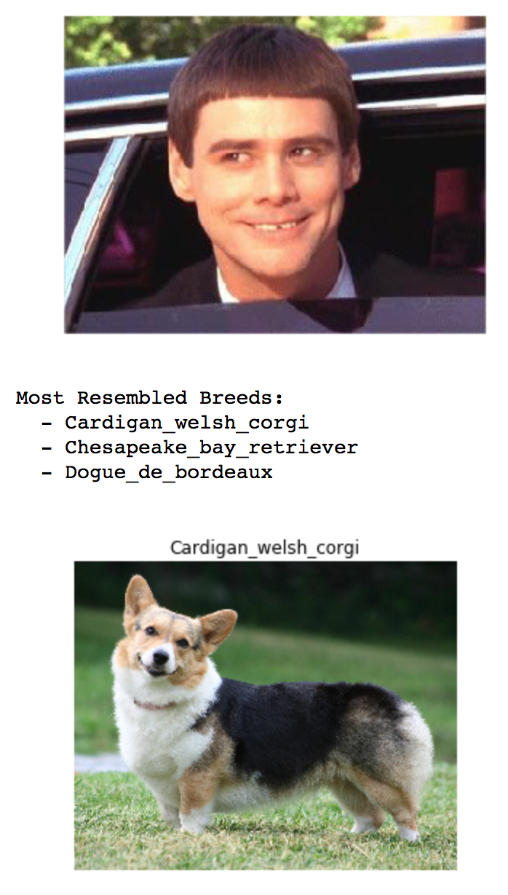

#### Udacity Artificial Intelligence Nanodegree
### Term 2: Project 5
# Classifying Dog Breeds Using CNNs and PyTorch

##### &nbsp;



*Image credit: [pethelpful.com](https://pethelpful.com/dogs/Tips-on-Choosing-the-Right-Dog-Breed)*


##### &nbsp;
## Overview
This project is inspired by the [Kaggle Dog Breed competition](https://www.kaggle.com/c/dog-breed-identification). The goal of this project is to build a pipeline that could be used in a web or mobile app to process real-world images. The pipeline must be able to:

1. Detect whether an image contains a dog or human, and distinguish between the two.
1. If given an image of a dog, the model predicts the canine’s breed with at least 60% accuracy. Random chance is only 0.75% since there are 133  dog breeds (classes) in the dataset.
1. If given an image of a human, the model identifies the dog breeds the person most resembles.

Here are two sample outputs from the final algorithm:



#### Learning Goals

- Explore top performing CNN models for classification, including **VGG, ResNet, InceptionV3, and Xception** network architectures.
	- And use using **transfer learning** to implement a subset of these architectures.
- First implement a pipeline using **Keras+Tensorflow**. Then, as an extra learning challenge, implement a different pipeline in **PyTorch**. (Note that these were done in separate iPython notebooks.)
- Understand the challenges involved in piecing together a series of models designed to perform various tasks in a data processing pipeline.  Each model has its strengths and weaknesses, and engineering a real-world application often involves solving many problems without a perfect answer. The solution developed in this project will be far from perfect, but it should create a fun user experience!

##### &nbsp;
## Approach
Outlined below is a summary of the steps and challenges encountered during this project. However, a more detailed walk-through along with the source code is available via the iPython notebooks.

- Data exploration &mdash; [.ipynb version](dog-breed-data-exploration.ipynb), [.html version](https://rawgit.com/tommytracey/aind-dog-project/master/dog-breed-data-exploration.html)
- Keras+Tensorflow implementation &mdash; [.ipynb version](dog_app_v6_keras.ipynb), [.html version](https://rawgit.com/tommytracey/aind-dog-project/master/dog_app_v6_keras.html)
- PyTorch implementation &mdash; [.ipynb version](dog_app_v7_pytorch.ipynb), [.html version](https://rawgit.com/tommytracey/aind-dog-project/master/dog_app_v7_pytorch.html)

### Steps (high-level)
1. Data Preparation
	- Load, inspect, and pre-process the data
	- Create datasets for training, validation, and testing
	- Augment the training data
1. Build CNN for recognizing dog breeds
	- Utilize transfer learning: Load pre-trained model and replace last fully connected layer.
	- Setup hyperparameters
	- Setup the optimization, regularization, and loss functions
	- Train the model on the dog images
	- Examine results
		- Is the model converging? What are the training and validation accuracies?
		- Preview model predictions
		- Tweak, tune, and iterate until predictions and metrics look sound
		- Run on test image set
	- Inference
		- Take a deeper look at model predictions including confidence scores
1. Incorporate human face detector
	- Choose an existing face detection package and test it
1. Integrate dog detector and human detector into single algorithm
	- Test algorithm on set of real-world images


##### &nbsp;
## Implementation & Results
*Coming Soon* &mdash; In the meantime, checkout the notebook links above.


##### &nbsp;
## Reflections
### Improving Accuracy
- **Additional training on the more difficult breeds.**
	- Create a new training set with a distribution based on prediction accuracy &mdash; i.e., poor performing breeds have more training images, while higher performing breeds have fewer images.
- **Deeper architecture + Augmentation**
	- My Keras+Tensorflow version used a deep architecture (Xception), but did not use augmentation. Conversely, my PyTorch version used augmentation, but a less elaborate architecture (ResNet). Combining these two and exploring other augmentation schemes *should* improve accuracy.
- **Train longer.**
	- In my PyTorch version, it seems I may have left some additional convergence on the table. My training accuracy was still quite low, probably due to all the augmentations. Perhaps given more training time this could have translated to marginally higher validation and test accuracies.

### PyTorch vs. Keras+Tensorflow

1. PyTorch dataloader ❤️
	- Makes creation of class labels seamless
	- No need for manual one-hot encoding
		- mapping between OHE vector indexes and their associated classes happens automagically
	- Creating a custom series of augmentations is a snap!
1. PyTorch strikes a good balance between simplicity and flexibility. I can see why many researchers prefer it. PyTorch also feels more like pure Python, whereas Tensorflow has some syntax and conventions that are unique to Tensorflow. "Sessions" anyone? In general, Tensorflow feels more lower level and nailing the syntax can be cumbersome. However, using Keras helps abstract away much of that complexity while still providing adequate customizations.
1. Tensorflow seems much more efficient and production ready.
	- Support. Tensorflow has a larger and more established support community. That said, I was able to find all of the PyTorch resources I needed; it often just took more digging.
	- Cost. The efficiencies of Tensorflow's static graph computation make much cheaper to run on AWS. Training the Tensorflow model was 1/10 the cost of my PyTorch model.
1. PyTorch is more flexible
	- The trade-off for Tensorflow's efficiency is less flexibility. For ML exploration and overall modularity, PyTorch's dynamic computational graph provides a lot more flexibility. Tensorflow feels a bit monolithic by comparison.
1. PyTorch seems much easier to debug.
	- The dynamic computational graph results in cleaner and more specific stack traces. Also, the syntax is simpler.  


##### &nbsp;
---

# Project Starter Code
In case you want to run this project yourself, below is the project starter code.

##### &nbsp;
## Setup Instructions
NOTE: These instructions have been modified for running the project on AWS, with specific recommendations for PyTorch. Udacity's original project code and setup instructions can be found [here](https://github.com/udacity/dog-project#project-instructions).

##### &nbsp;

1. Create an Amazon Web Services EC2 instance.

	I recommend [Deep Learning AMI (Ubuntu) Version 10.0 - ami-e580c79d](https://aws.amazon.com/marketplace/pp/B077GCH38C), which comes with most of the packages you'll need already pre-installed.

	Your instance needs at least 50 GB of GPU memory to run this project in PyTorch. In my limited experience, PyTorch is much more memory intensive than Tensorflow. The smaller p2.xlarge EC2 instance with 12 GB of GPU memory worked fine for my initial implementation of the project in Keras+Tensorflow. However, this same instance kept encountering 'out of memory' errors when running the project in PyTorch. Once I switched to a p2.8xlarge instance (96 GB GPU memory), the project ran smoothly &mdash; but, keep in mind that this larger instance is much more costly, ~$7/hr vs $1/hr. You can compare the different instance types yourself [here](https://aws.amazon.com/ec2/instance-types/) (the P2 and P3 instances are found under "Accelerated Computing"). Again, if you're running the project on Tensorflow, the smaller p2.xlarge EC2 instance is fine.

	When setting-up your instance, remember to open port 8888 for Jupyter Notebook in your [security group settings](https://www.evernote.com/l/ABdh1MljZRRFPKBZEsh0XH-oBMd28_J-yfs).

2. Start your EC2 instance via the console, then login via terminal.

	```
	ssh -i <path to key> ubuntu@<IPv4 Public IP address>
	```

3. Activate your PyTorch environment for Python 3.6.

	```
	source activate pytorch_p36
	```

	Or, if you're using tensorflow, you'd enter `source activate tensorflow_p36`. A complete list of Anaconda environments is available [here](https://docs.aws.amazon.com/dlami/latest/devguide/tutorial-conda.html#tutorial-conda-login). Or simply enter `conda info --envs` in your terminal.

4. Install OpenCV

	```
	conda install -c conda-forge opencv
	```

5. Clone the repository and navigate to the downloaded folder.

	```
	git clone https://github.com/udacity/dog-project.git
	cd dog-project
	```

6. Download the [dog dataset](https://s3-us-west-1.amazonaws.com/udacity-aind/dog-project/dogImages.zip). Then unzip the folder. Make sure it's located at `path/to/dog-project/dogImages`. If you are using a Windows machine, you may want to use [7zip](http://www.7-zip.org/) to extract the folder.

	```
	wget https://s3-us-west-1.amazonaws.com/udacity-aind/dog-project/dogImages.zip
	unzip dogImages.zip
	```

7. Download the [human dataset](https://s3-us-west-1.amazonaws.com/udacity-aind/dog-project/lfw.zip).  Unzip the folder, making sure it's at location `path/to/dog-project/lfw`.  

	```
	wget https://s3-us-west-1.amazonaws.com/udacity-aind/dog-project/lfw.zip
	unzip lfw.zip
	```

8. Open Jupyter Notebook via your AWS terminal.
	```
	jupyter notebook --ip=0.0.0.0 --no-browser
	```

	Then, to open Jupyter in your browser, start by copying the URL provided in your terminal window. It should look something like this: `http://ip-170-35-87-127:8888/?token=eqith4949181huhfkjqdhfh1948`

	Paste this URL into your browser and replace the `http://ip-170-35-87-127` portion to the left of the colon ":" with the IP address for your EC2 instance.

9. Before running code, verify that the kernel matches your Conda environment. If you need to change the kernel, go to the drop-down menu (Kernel > Change kernel). Then, you can start running code cells in the notebook.
